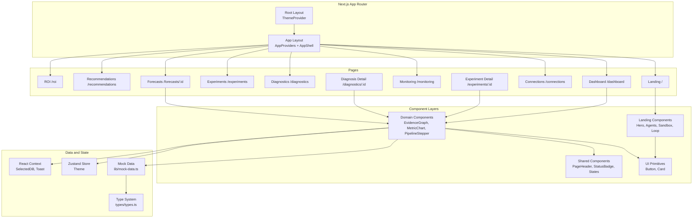
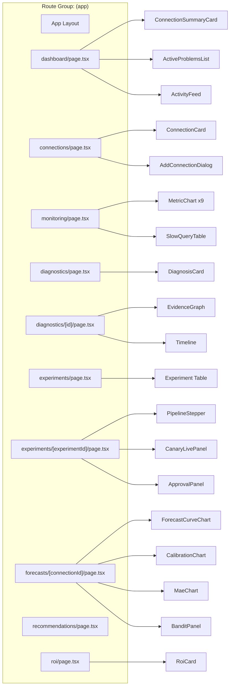
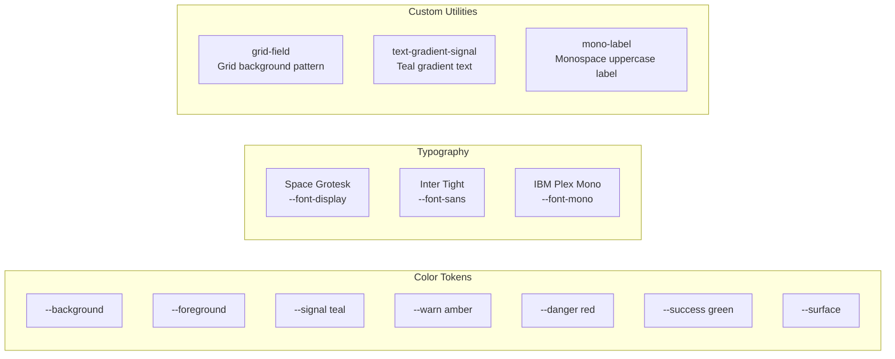
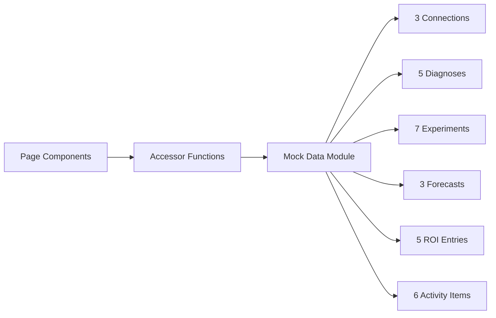

<div align="center">

# Zentrix.ai Frontend

**AI-Powered Database Intelligence Dashboard**

A modern, responsive frontend for the Zentrix autonomous PostgreSQL optimization platform. Visualize root cause investigations, monitor live metrics, verify optimization experiments, and track ROI — all in a single diagnostic console.

[](https://nextjs.org/)
[](https://react.dev/)
[](https://www.typescriptlang.org/)
[](https://tailwindcss.com/)

</div>

---

## Table of Contents

- [Overview](#overview)
- [Architecture Overview](#architecture-overview)
- [Features](#features)
- [Technology Stack](#technology-stack)
- [Folder Structure](#folder-structure)
- [Routes](#routes)
- [Component Architecture](#component-architecture)
- [State Management](#state-management)
- [Design System](#design-system)
- [Data Layer](#data-layer)
- [Type System](#type-system)
- [Configuration](#configuration)
- [Installation](#installation)
- [Development](#development)
- [Scripts](#scripts)
- [Linting](#linting)
- [Deployment](#deployment)
- [Contributing](#contributing)
- [License](#license)

---

## Overview

The Zentrix frontend is a Next.js 16 App Router application built with React 19, TypeScript, and Tailwind CSS v4. It serves as the visual interface for the Zentrix autonomous database intelligence platform, providing:

- **Fleet Dashboard** — real-time overview of all monitored PostgreSQL databases
- **Live Monitoring** — streaming metrics with 2-second refresh intervals
- **Root Cause Investigation** — interactive evidence graphs and timelines
- **Experiment Verification** — full lifecycle from simulation to canary deployment
- **Predictive Forecasting** — degradation probability curves and model performance
- **Cost Analytics** — dollar savings tracking per optimization

### Design Philosophy

The frontend follows the **"Instrument"** design language — a diagnostic console aesthetic with deep ink surfaces, phosphor-teal signal color, and oklch-based color tokens. Every component is designed to convey precision and reliability, matching the backend's evidence-first philosophy.

---

## Architecture Overview



---

## Features

| Feature | Description |
|---------|-------------|
| **Fleet Dashboard** | Aggregate view of all monitored databases with health status, latency sparklines, and active problem counts |
| **Live Monitoring** | 9 real-time metric streams (p50/p95/p99 latency, throughput, error rate, connections, CPU, cache, locks) with 2s refresh |
| **Evidence Graphs** | Interactive SVG causal diagrams showing Trigger → Mechanism → Symptom relationships with animated trace lines |
| **Diagnosis Detail** | Full root-cause report with confidence meter, contributing causes, timeline, supporting evidence, and recommendations |
| **Experiment Lifecycle** | 6-step pipeline stepper (HypoPG → ML → Shadow DB → Stats → Skeptic → Policy) with verification reports |
| **Canary Monitoring** | Live canary metric tiles with auto-advance, progress bar, and commit/rollback outcomes |
| **Approval Gates** | Human approval UI with confirm dialog for production deployment decisions |
| **Forecasting** | Degradation probability curves, model calibration charts, MAE history, and Thompson bandit performance |
| **ROI Analytics** | Dollar savings tracking per optimization with monthly aggregates |
| **Multi-DB Support** | Switch between multiple PostgreSQL databases with a single selector |
| **Dark/Light Theme** | oklch-based design system with View Transitions API animated theme toggle |
| **Landing Page** | Marketing page with animated hero, agent architecture, pipeline walkthrough, and CTA |
| **Responsive** | Mobile-first design with adaptive sidebar and top bar |
| **Toast Notifications** | Auto-dismissing toast system with success/info/warning/danger variants |

---

## Technology Stack

### Core

| Layer | Technology | Version |
|-------|-----------|---------|
| Framework | Next.js | 16.3.1 |
| UI Library | React | 19.2.8 |
| Language | TypeScript | ^5 |
| Bundler | Turbopack | (built-in) |

### Styling

| Layer | Technology | Version |
|-------|-----------|---------|
| CSS Framework | Tailwind CSS | v4 |
| PostCSS Plugin | @tailwindcss/postcss | ^4 |
| CSS Compiler | LightningCSS | ^1.33.0 |
| Animation Utilities | tw-animate-css | ^1.4.0 |

### UI Components

| Layer | Technology | Version |
|-------|-----------|---------|
| Component System | shadcn/ui | ^4.18.0 |
| Headless Primitives | Radix UI | ^1.6.7 |
| Icon Library | Lucide React | ^1.33.0 |
| Variant Management | class-variance-authority | ^0.7.1 |
| Class Merging | clsx + tailwind-merge | ^2.1.1 / ^3.6.0 |

### State and Data

| Layer | Technology | Version |
|-------|-----------|---------|
| State Management | Zustand | ^5.0.15 |
| Theme Management | next-themes | ^0.4.6 |
| Charting | Recharts | ^3.10.1 |
| Animation | Framer Motion | ^13.1.0 |

### Development

| Layer | Technology | Version |
|-------|-----------|---------|
| Linter | ESLint | ^9 |
| ESLint Config | eslint-config-next | 16.3.1 |
| Type Checker | TypeScript | ^5 |

---

## Folder Structure

```
apps/frontend/
|
|-- app/                              # Next.js App Router pages
|   |-- layout.tsx                    # Root layout (ThemeProvider)
|   |-- page.tsx                      # Landing page (/)
|   +-- (app)/                        # Authenticated app route group
|       |-- layout.tsx                # App shell (AppProviders + AppShell)
|       |-- dashboard/page.tsx        # /dashboard
|       |-- connections/page.tsx      # /connections
|       |-- monitoring/page.tsx       # /monitoring
|       |-- diagnostics/
|       |   |-- page.tsx              # /diagnostics
|       |   +-- [id]/page.tsx         # /diagnostics/:id
|       |-- experiments/
|       |   |-- page.tsx              # /experiments
|       |   +-- [experimentId]/page.tsx
|       |-- forecasts/
|       |   +-- [connectionId]/page.tsx
|       |-- recommendations/page.tsx  # /recommendations
|       +-- roi/page.tsx             # /roi
|
|-- components/                       # React components (45+ total)
|   |-- app-providers.tsx             # DbContext + ToastContext providers
|   |-- app-shell.tsx                 # Sidebar + top bar layout shell
|   |-- confidence-meter.tsx          # Visual confidence bar (0-100%)
|   |-- database-selector.tsx         # Dropdown to select active database
|   |-- page-header.tsx               # Reusable page header
|   |-- sparkline.tsx                 # Inline SVG sparkline chart
|   |-- states.tsx                    # EmptyState, Skeleton, ErrorBanner
|   |-- status-badge.tsx              # Color-coded status badge
|   |-- theme-toggle.tsx              # Dark/light theme toggle
|   |
|   |-- connections/                  # Connection management
|   |   |-- add-connection-dialog.tsx
|   |   +-- connection-card.tsx
|   |
|   |-- dashboard/                    # Dashboard page
|   |   |-- active-problems-list.tsx
|   |   |-- activity-feed.tsx
|   |   +-- connection-summary-card.tsx
|   |
|   |-- diagnostics/                  # Diagnostics pages
|   |   |-- diagnosis-card.tsx
|   |   |-- evidence-graph.tsx        # SVG causal evidence graph
|   |   +-- timeline.tsx
|   |
|   |-- forecasting/                  # Forecast charts
|   |   +-- forecast-charts.tsx       # ForecastCurve, Calibration, MAE, Bandit
|   |
|   |-- landing/                      # Landing page (13 components)
|   |   |-- hero.tsx, hero-visuals.tsx, evidence-graph.tsx
|   |   |-- evidence.tsx, howItworks.tsx, agents.tsx
|   |   |-- sandbox.tsx, loop.tsx, roi.tsx
|   |   |-- cta.tsx, nav.tsx, section-heading.tsx
|   |   +-- theme-provider.tsx
|   |
|   |-- monitoring/                   # Monitoring page
|   |   |-- metric-chart.tsx          # Live Recharts area chart
|   |   +-- slow-query-table.tsx
|   |
|   |-- roi/
|   |   +-- roi-card.tsx
|   |
|   |-- simulation/                   # Experiment pages
|   |   |-- approval-panel.tsx
|   |   |-- canary-live-panel.tsx
|   |   +-- pipeline-stepper.tsx      # 6-step experiment pipeline
|   |
|   +-- ui/                           # shadcn/ui primitives
|       |-- animated-theme-toggler.tsx
|       |-- button.tsx
|       +-- card.tsx
|
|-- hooks/
|   +-- use-mobile.tsx                # useIsMobile() hook (768px)
|
|-- lib/                              # Utilities and data
|   |-- format.ts                     # relativeTime, pct, usd, deltaPct
|   |-- labels.ts                     # RootCauseClass and Recommendation labels
|   |-- live-metrics.ts               # Live metric generation and simulation
|   |-- mock-data.ts                  # All mock data (893 lines)
|   +-- utils.ts                      # cn() class merge utility
|
|-- stores/
|   +-- theme-store.ts                # Zustand theme store
|
|-- styles/
|   +-- globals.css                   # Design system (oklch tokens, animations)
|
|-- types/
|   +-- types.ts                      # All TypeScript interfaces (240 lines)
|
|-- tests/                            # (placeholder for future tests)
|-- services/                         # (placeholder for API client)
+-- features/                         # (placeholder for feature modules)
```

---

## Routes

| Route | Page | Description |
|-------|------|-------------|
| `/` | Landing | Marketing page with Hero, Evidence, Agents, Sandbox, Loop, ROI sections |
| `/dashboard` | Dashboard | Fleet overview: DB stats, connection cards, active problems, activity feed |
| `/connections` | Connections | Database connection management, add/test connections |
| `/monitoring` | Monitoring | Live real-time metrics (9 metrics, streaming 2s intervals), slow query table |
| `/diagnostics` | Diagnostics | Diagnosis list with scope/status/confidence filters |
| `/diagnostics/:id` | Diagnosis Detail | Evidence graph, timeline, supporting evidence, recommendations |
| `/experiments` | Experiments | Experiment history table with DB/verdict/outcome filters |
| `/experiments/:experimentId` | Experiment Detail | Pipeline stepper, verification report, skeptic, policy, approval, canary |
| `/forecasts/:connectionId` | Forecasts | Degradation curve, suggestions, calibration, MAE, bandit |
| `/recommendations` | Recommendations | All recommendations ranked by certainty, with type filters |
| `/roi` | ROI | Cost/performance analytics: total savings, ROI cards |

### Page Component Map



---

## Component Architecture

### Shared Components

| Component | File | Description |
|-----------|------|-------------|
| `AppProviders` | `app-providers.tsx` | Provides `DbContext` (selected DB) and `ToastContext` with auto-dismiss toast viewport |
| `AppShell` | `app-shell.tsx` | Full layout: fixed sidebar (7 nav items), top bar with DB selector, user avatar, active problems badge |
| `PageHeader` | `page-header.tsx` | Reusable header with title, description, actions slot, breadcrumb slot |
| `DatabaseSelector` | `database-selector.tsx` | Custom dropdown to switch active database connection |
| `StatusBadge` | `status-badge.tsx` | Color-coded badge mapping domain strings (VERIFIED, Critical, etc.) to semantic tones |
| `ConfidenceMeter` | `confidence-meter.tsx` | Horizontal bar showing 0-100% confidence with green/yellow/red color coding |
| `Sparkline` | `sparkline.tsx` | Inline SVG sparkline chart with gradient fill |
| `EmptyState` | `states.tsx` | Empty state placeholder with icon, title, description, optional action |
| `ErrorBanner` | `states.tsx` | Warning/danger alert banner |
| `Skeleton` | `states.tsx` | Loading skeleton placeholders |

### Domain Components

| Component | Domain | Description |
|-----------|--------|-------------|
| `ConnectionSummaryCard` | Dashboard | DB health, p95 latency, sparkline, active problems count |
| `ActiveProblemsList` | Dashboard | Table of active diagnoses with root cause, confidence |
| `ActivityFeed` | Dashboard | Timeline of recent system activities |
| `ConnectionCard` | Connections | DB connection card with health checks |
| `AddConnectionDialog` | Connections | Modal with connection string / field modes, 4-step test |
| `DiagnosisCard` | Diagnostics | Root cause badge, confidence meter, contributing causes |
| `EvidenceGraph` | Diagnostics | SVG causal graph with 3 columns, Bezier curves, arrow markers |
| `Timeline` | Diagnostics | Vertical timeline with icon-mapped event types |
| `MetricChart` | Monitoring | Live Recharts area chart with threshold detection |
| `SlowQueryTable` | Monitoring | Top SQL statements by p99 latency |
| `PipelineStepper` | Simulation | 6-step horizontal stepper for experiment lifecycle |
| `ApprovalPanel` | Simulation | Human approval UI with confirm dialog |
| `CanaryLivePanel` | Simulation | 8 metric tiles, auto-advance, progress bar |
| `ForecastCurveChart` | Forecasting | Degradation probability over 14 days with confidence band |
| `CalibrationChart` | Forecasting | Predicted vs actual coverage per bucket |
| `MaeChart` | Forecasting | MAE improvement across model versions |
| `BanditPanel` | Forecasting | Thompson bandit strategy performance |
| `RoiCard` | ROI | Individual ROI entry with savings |

### Landing Components (13)

| Component | Description |
|-----------|-------------|
| `Hero` | Badge, headline ("A DBA that proves it"), CTAs, stats grid |
| `HeroVisual` | Animated diagnosis simulation: 4-stage rail, 5 agent rows |
| `EvidenceGraph` | Animated SVG graph with 6 nodes and animated trace dashes |
| `Evidence` | 5-stage pipeline cards (Collect/Detect/Diagnose/Verify/Deploy) |
| `Pipeline` | "How it works" vertical timeline with 6 steps |
| `Agents` | Tabbed agent architecture: 3 graphs (Diagnosis/Simulation/Forecast) |
| `Sandbox` | Experiment timeline with 6 steps, baseline/candidate stats |
| `Loop` | Closed-loop section: animated MAE bar chart, bandit, drift cards |
| `Roi` | Animated counters ($18,400, 71%, 126h, 43) |
| `Cta` | CTA section with email form |
| `Footer` | Logo, tagline, Docs/Architecture/Security links |
| `Nav` | Fixed top nav with anchor links and animated theme toggler |
| `SectionHeading` | Reusable animated section heading |

---

## State Management

```mermaid
graph TD
    subgraph "Global State"
        ZUSTAND["Zustand Store<br/>useThemeStore<br/>dark: boolean"]
    end

    subgraph "React Context"
        DB_CTX["DbContext<br/>selectedId: string<br/>setSelectedId()"]
        TOAST_CTX["ToastContext<br/>toast(): void"]
    end

    subgraph "Local State - useState"
        FILTERS["Filter States<br/>scope, status, verdict"]
        UI_S["UI States<br/>dialog open, expanded rows"]
        SIM["Simulation States<br/>canary metrics, approval flow"]
    end

    ZUSTAND -->|toggle| THEME["Theme Toggle"]
    DB_CTX -->|selectedId| SIDEBAR["Sidebar Nav"]
    DB_CTX -->|selectedId| PAGES["Page Data"]
    TOAST_CTX -->|toast()| TOASTS["Toast Viewport"]
```

| Store | Type | Purpose |
|-------|------|---------|
| `useThemeStore` | Zustand | Manages `dark: boolean` with `toggle()` and `setDark()` |
| `DbContext` | React Context | Stores `selectedId` (current database connection) |
| `ToastContext` | React Context | Provides `toast()` for temporary notifications (4s auto-dismiss) |

---

## Design System

### "Instrument" Aesthetic

The design system is defined in `styles/globals.css` using oklch color space tokens.



### Color Palette

| Token | Light | Dark | Purpose |
|-------|-------|------|---------|
| `--signal` | `oklch(0.62 0.13 190)` | `oklch(0.8 0.14 190)` | Primary accent (phosphor-teal) |
| `--warn` | `oklch(0.72 0.15 72)` | `oklch(0.8 0.15 78)` | Warning (amber) |
| `--danger` | `oklch(0.55 0.2 27)` | `oklch(0.66 0.19 25)` | Error / critical |
| `--success` | `oklch(0.6 0.14 155)` | `oklch(0.75 0.15 158)` | Verified / healthy |
| `--info` | `oklch(0.55 0.13 250)` | `oklch(0.7 0.13 245)` | Informational |

### Typography

| Font | CSS Variable | Usage |
|------|-------------|-------|
| Space Grotesk | `--font-display` | Headlines, section titles |
| Inter Tight | `--font-sans` | Body text, UI elements |
| IBM Plex Mono | `--font-mono` | Code, labels, metric values |

### Animations

| Animation | Purpose |
|-----------|---------|
| `trace-dash` | Animated dashed stroke on evidence graph edges |
| `pulse-node` | Pulsing node opacity and scale on evidence graph |
| `scan-sweep` | Vertical scan line sweep effect |
| View Transitions API | Theme toggle with 7 geometric shapes |

### Chart Colors

| Token | Usage |
|-------|-------|
| `--chart-1` | Primary metric line (teal) |
| `--chart-2` | Secondary metric (green) |
| `--chart-3` | Warning metric (amber) |
| `--chart-4` | Info metric (blue) |
| `--chart-5` | Danger metric (red) |

---

## Data Layer

### Current State: Mock Data

All data is currently served from `lib/mock-data.ts` (893 lines). This module acts as a typed API client stand-in with accessor functions designed to be replaced with real API calls.



### Mock Data Accessors

| Function | Returns |
|----------|---------|
| `getConnections()` | All database connections |
| `getConnection(id)` | Single connection by ID |
| `getDiagnoses(connId?)` | Diagnoses, optionally filtered by connection |
| `getDiagnosis(id)` | Single diagnosis with full detail |
| `getExperiments(connId?)` | Experiments, optionally filtered by connection |
| `getExperiment(id)` | Single experiment with full detail |
| `getForecast(connId)` | Forecast for a connection |
| `getRoiEntries(connId?)` | ROI entries, optionally filtered |
| `getActivity()` | Recent activity feed |

### Live Metrics Simulation

`lib/live-metrics.ts` generates deterministic pseudo-random metric data for the monitoring page:

- **9 metric specs**: p50, p95, p99 latency, throughput, error rate, connections, CPU, cache hit, locks
- **Deterministic seeding**: Same connection ID produces same baseline
- **Mean-reverting random walk**: Realistic metric fluctuations
- **Stress multipliers**: Critical/Degraded connections show elevated metrics

### Future: API Integration

The `services/` directory is prepared for API client implementation. When the backend is connected, replace mock accessor functions with HTTP calls:

```typescript
// Current (mock)
export const getConnections = () => connections

// Future (API)
export const getConnections = async () => {
  const res = await fetch(`${API_URL}/api/v1/connections`, {
    credentials: 'include',
  })
  return res.json()
}
```

---

## Type System

All TypeScript interfaces are defined in `types/types.ts` (240 lines).

### Domain Enums

| Type | Values |
|------|--------|
| `RootCauseClass` | STALE_STATISTICS, PLAN_FLIP, CARDINALITY_MISESTIMATION, LOCK_CONTENTION, INDEX_MISSING, INDEX_UNUSED, VACUUM_LAG, BLOAT, BUFFER_PRESSURE, IO_SATURATION, TEMP_SPILL, CONNECTION_CONTENTION, CHECKPOINT_PRESSURE, UNKNOWN |
| `CausalRank` | PRIMARY, CONTRIBUTING, CORRELATED, UNRELATED |
| `Verdict` | VERIFIED, CONDITIONAL, REJECTED |
| `DeploymentOutcome` | COMMIT, ROLLBACK, IN_PROGRESS, AWAITING_APPROVAL |
| `ApprovalState` | PENDING_APPROVAL, APPROVED, REJECTED |
| `DbProvider` | Neon, AWS RDS, Supabase, Self-hosted |
| `ConnectionStatus` | Connected, Testing, Failed, Needs Attention |
| `HealthStatus` | Healthy, Degraded, Critical |
| `PipelineStage` | HypoPG filter, ML prediction, Shadow DB simulation, Statistical verification, Skeptic review, Policy engine |

### Core Interfaces

| Interface | Description |
|-----------|-------------|
| `DatabaseConnection` | Full DB connection with health, checks, sparkline, active problems |
| `Diagnosis` | Root cause with evidence graph, timeline, recommendations |
| `EvidenceNode` | Causal graph node (event/cause/symptom) |
| `EvidenceEdge` | Directed edge between evidence nodes |
| `Experiment` | Full lifecycle: candidate, verdict, outcome, comparisons, skeptic, policy |
| `MetricComparison` | Baseline vs candidate comparison with betterWhenLower flag |
| `SkepticFinding` | Adversarial check: concern, pass/flagged status, note |
| `PolicyCheck` | Deterministic rule: rule text, passed boolean |
| `CanaryPoint` | Live canary metric snapshot |
| `Forecast` | Full forecast: curve, suggestions, calibration, MAE, bandit |
| `RoiEntry` | ROI entry: description, improvement, monthly savings |
| `ActivityItem` | Activity event: time, connection, message, kind |
| `Recommendation` | Optimization suggestion with type, rationale, predicted impact |

---

## Configuration

| File | Purpose |
|------|---------|
| `next.config.ts` | Next.js config with Turbopack enabled |
| `tsconfig.json` | TypeScript strict mode, ES2017 target, `@/*` path alias |
| `postcss.config.mjs` | PostCSS with `@tailwindcss/postcss` plugin |
| `eslint.config.mjs` | ESLint flat config: core-web-vitals + TypeScript |
| `components.json` | shadcn/ui config: radix-nova style, neutral base color |

### Path Aliases

| Alias | Resolves To |
|-------|-------------|
| `@/*` | `./` (project root) |
| `@/components` | `./components` |
| `@/components/ui` | `./components/ui` |
| `@/lib` | `./lib` |
| `@/hooks` | `./hooks` |

---

## Installation

### Prerequisites

- Node.js 18+ (20+ recommended)
- npm, yarn, or pnpm

### Setup

```bash
# Navigate to frontend
cd apps/frontend

# Install dependencies
npm install

# Start development server
npm run dev
```

The app will be available at `http://localhost:3000`.

---

## Development

### Running Locally

```bash
npm run dev
```

Starts the Next.js development server with Turbopack on `http://localhost:3000`.

### Building for Production

```bash
npm run build
```

Creates an optimized production build in `.next/`.

### Starting Production Server

```bash
npm run start
```

Serves the production build on `http://localhost:3000`.

---

## Scripts

| Command | Description |
|---------|-------------|
| `npm run dev` | Start Next.js dev server with Turbopack |
| `npm run build` | Create optimized production build |
| `npm run start` | Start production server |
| `npm run lint` | Run ESLint with core-web-vitals + TypeScript rules |

---

## Linting

```bash
npm run lint
```

Uses ESLint 9 flat config with:
- `eslint-config-next/core-web-vitals` — Next.js recommended rules
- `eslint-config-next/typescript` — TypeScript type-aware rules

Ignores: `.next/`, `out/`, `build/`.

---

## Deployment

### Vercel (Recommended)

The frontend is a standard Next.js app and deploys seamlessly to Vercel:

1. Connect your Git repository to Vercel
2. Set the root directory to `apps/frontend`
3. Framework preset: Next.js
4. Deploy

### Docker

```dockerfile
FROM node:20-alpine AS builder
WORKDIR /app
COPY apps/frontend/package*.json ./
RUN npm ci
COPY apps/frontend/ .
RUN npm run build

FROM node:20-alpine AS runner
WORKDIR /app
COPY --from=builder /app/.next/standalone ./
COPY --from=builder /app/.next/static ./.next/static
EXPOSE 3000
CMD ["node", "server.js"]
```

### Environment Variables

The frontend currently uses **no environment variables** — all data is mocked. When backend integration is added:

```env
NEXT_PUBLIC_API_BASE_URL=http://localhost:8000
```

---

## Contributing

1. Fork the repository
2. Create a feature branch (`git checkout -b feature/amazing-feature`)
3. Commit your changes (`git commit -m 'Add amazing feature'`)
4. Push to the branch (`git push origin feature/amazing-feature`)
5. Open a Pull Request

### Code Standards

- TypeScript strict mode — no `any` types
- React 19 with hooks — no class components
- Tailwind CSS v4 — no inline styles
- shadcn/ui components — extend, don't duplicate
- Framer Motion for animations — CSS animations for simple cases
- ESLint must pass before commit

### Component Guidelines

- All components use `'use client'` directive
- Props interfaces defined inline or at top of file
- Domain components go in `components/{domain}/`
- Shared components go in `components/`
- UI primitives go in `components/ui/`

---

## License

This project is licensed under the MIT License — see the [LICENSE](../../LICENSE) file for details.

---

<div align="center">

**Built with precision for database intelligence**

Zentrix.ai — See your database like never before.

</div>
